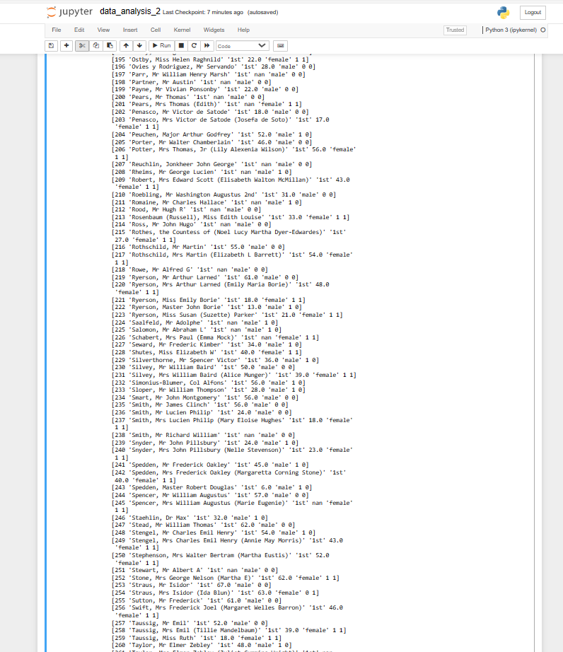
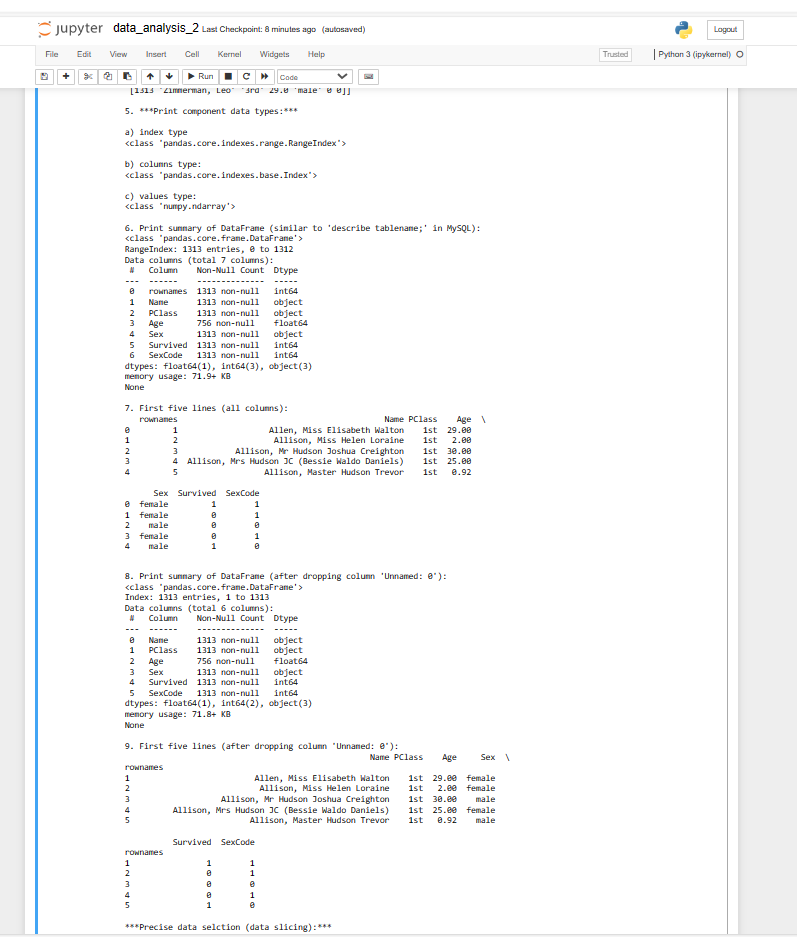

> **NOTE:** This README.md file should be placed at the **root of each of your repos directories.**
>
>Also, this file **must** use Markdown syntax, and provide project documentation as per below--otherwise, points **will** be deducted.
>

# LIS4369

## Shaun Timothee

### Assignment 4 Requirements:

*Data Analysis 2*

1. Code and run demo.py.
2. If errors, more than likely missing installations.
3. Test Python Package Installer: pip freeze
4. Research how to do the following installations:
        a. pandas (only if missing)
        b. pandas-datareader (only if missing)
        c. matplotlib (only if missing)
5. Create at least three functions that are called by the program:
        a. main(): calls two other functions.
        b. get_requirements(): displays the program requirements.
        c. data_analysis_2(): displays the results as per demo.py.
6. Display graph as per instructions w/in demo.py

#### README.md file should include the following items:

* Screenshot of a4_data_analysis_2 application running
* [data_analysis_2.ipynb](a4_data_analysis_2/data_analysis_2.ipynb)

> This is a blockquote.
> 
> This is the second paragraph in the blockquote.
>
>  
### Assignment Answer:
- There is a lack of data in the data set

#### Assignment Screenshots:

*Screenshot of data_analysis_2 running on VS code*:

![data_analysis_2 running on Vs code] 

*Screenshot of a4_data_analysis_2 on Jupyter Notebook*:

![a4_data_analysis_2 running on Jupyter Notebook] 
![a4_data_analysis_2 running on Jupyter Notebook] 
![a4_data_analysis_2 running on Jupyter Notebook] 
![a4_data_analysis_2 running on Jupyter Notebook] 
![a4_data_analysis_2 running on Jupyter Notebook] 
![a4_data_analysis_2 running on Jupyter Notebook] 
![a4_data_analysis_2 running on Jupyter Notebook] 
![a4_data_analysis_2 running on Jupyter Notebook] 
![a4_data_analysis_2 running on Jupyter Notebook] 
![a4_data_analysis_2 running on Jupyter Notebook] 
### Skillset 10 - 12 Screenshots:
| Skillset 10 | Skillset 11 | Skillset 12|
|--------------------|--------------------|--------------------|
| |
#### Tutorial Links:

*Bitbucket Tutorial - Station Locations:*
[A4 Bitbucket Station Locations Tutorial Link](https://bitbucket.org/username/bitbucketstationlocations/ "Bitbucket Station Locations")

*Tutorial: Request to update a teammate's repository:*
[A4 My Team Quotes Tutorial Link](https://bitbucket.org/username/myteamquotes/ "My Team Quotes Tutorial")

