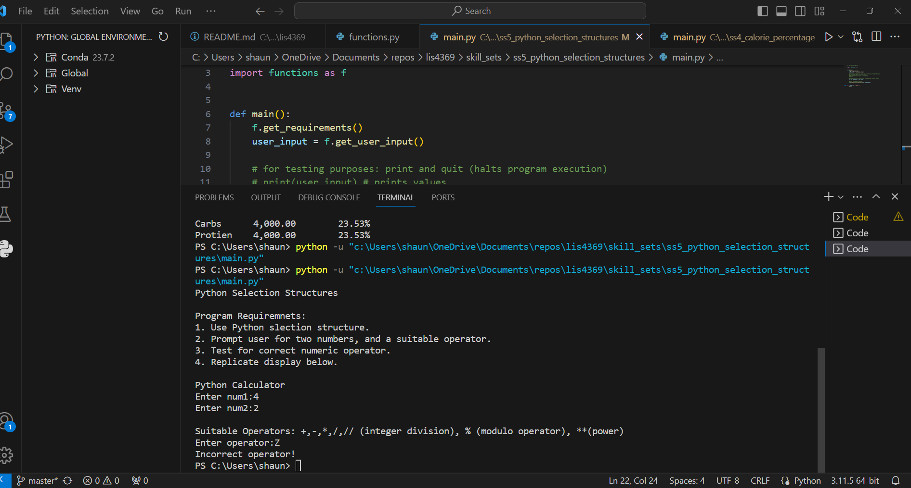

> **NOTE:** This README.md file should be placed at the **root of each of your repos directories.**
>
>Also, this file **must** use Markdown syntax, and provide project documentation as per below--otherwise, points **will** be deducted.
>

# LIS4369

## Shaun Timothee

### Assignment 3 Requirements:

*Painting Estimator*

1. Calculate home interior paint cost
2. Must use float data type
3. Must use SQFT_PER_GALLON constant (350).
4. Must use iteration structure (aka "loop").
5. Format right-aligh numbers, and round to two decimals places.
6. Create at least five functions that are called by the program:
        a. main(): calls two other functions: get_requirements() and estimate_painting_cost()
        b. get_requirements(): displays the program requirements.
        c. estimate_painting_cost(): calculates interior home painting, and calls print functions.
        d. print_painting_estimate(): displays painting costs.
        e. print_painting_percentage(): displays painting costs percentages.

#### README.md file should include the following items:

* Screenshot of a3_painting_estimator application running
* [a3_painting_estimator.ipynb](a3_painting_estimator/a3_painting_estimator.ipynb)

> This is a blockquote.
> 
> This is the second paragraph in the blockquote.
>
>  

#### Assignment Screenshots:

*Screenshot of a3_painting_estimator running on IDLE*:

![a3_painting_estimator running on IDLE]

*Screenshot of a3_painting_estimator running on VS code*:

*Screenshot of a3_painting_estimator on Jupyter Notebook*:

### Skillset 4 - 6 Screenshots:
| Skillset 4 | Skillset 5 | Skillset 6|
|--------------------|--------------------|--------------------|
 |  | 
#### Tutorial Links:

*Bitbucket Tutorial - Station Locations:*
[A3 Bitbucket Station Locations Tutorial Link](https://bitbucket.org/username/bitbucketstationlocations/ "Bitbucket Station Locations")

*Tutorial: Request to update a teammate's repository:*
[A3 My Team Quotes Tutorial Link](https://bitbucket.org/username/myteamquotes/ "My Team Quotes Tutorial")

