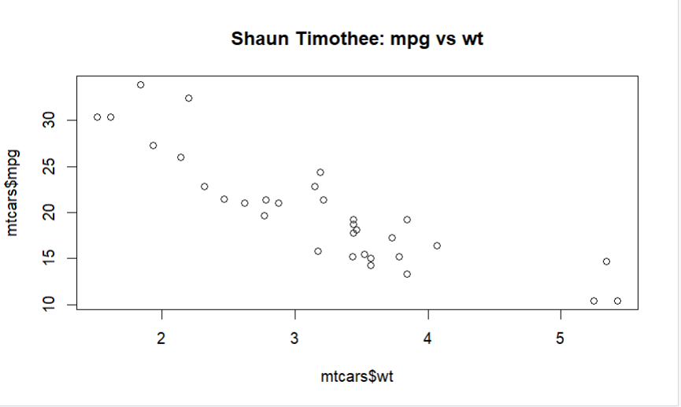
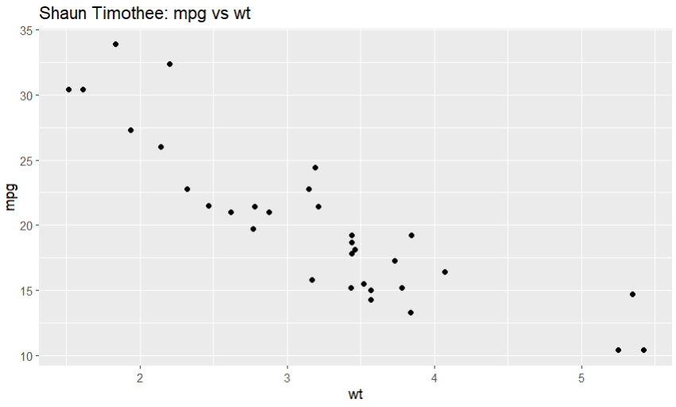

> **NOTE:** This README.md file should be placed at the **root of each of your repos directories.**
>
>Also, this file **must** use Markdown syntax, and provide project documentation as per below--otherwise, points **will** be deducted.
>

# LIS4369

## Shaun Timothee

### Project 2 Requirements:

*R Language*

1. Use head and tail to look at first few and last few records.
2. Use str and names to look at structure and column names of a data frame.
3. Use $ notation to look at particular column name.
4. Use[] square brackets (row,column) notation to look at a particular value.
5. Select data in I row and J column (one field) for DataFrameX: DataFrameX[I,J]
6. Data in  I row: DataFrmaeX[I,] # displayrow/record I with column names.

#### README.md file should include the following items:

> This is a blockquote.
> 
> This is the second paragraph in the blockquote.
>
>  

#### Assignment Screenshots:

*Screenshot of lis4369_p2.R 4 panel running on RStudio*:

![Project 2 Rstudio running on RStudio]

*Screenshot of two seperate plots on Rstudio*:

![lis4369_p2.R plot running on RStudio] 
![lis4369_p2.R plot running on RStudio] 

### Links Provided

*Link to output text file and R file*

[lis4369_p2_output.txt](lis4369_p2_output.txt)

[lis4369_p2.R](lis4369_p2.R)

#### Tutorial Links:

*Bitbucket Tutorial - Station Locations:*
[P2 Bitbucket Station Locations Tutorial Link](https://bitbucket.org/username/bitbucketstationlocations/ "Bitbucket Station Locations")

*Tutorial: Request to update a teammate's repository:*
[P2 My Team Quotes Tutorial Link](https://bitbucket.org/username/myteamquotes/ "My Team Quotes Tutorial")

