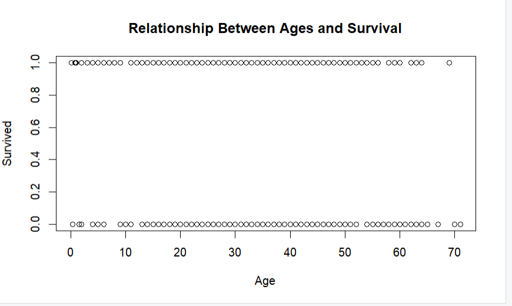
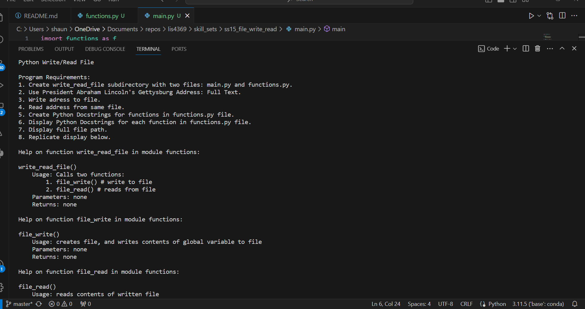

> **NOTE:** This README.md file should be placed at the **root of each of your repos directories.**
>
>Also, this file **must** use Markdown syntax, and provide project documentation as per below--otherwise, points **will** be deducted.
>

# LIS4369

## Shaun Timothee

### Assignment 5 Requirements:

*RStudio Installation and lis4369_as.r*

1. Complete the following tutorial: Introduction_to_R_Setup_and_Tutorial.
2. Code and run lis4369_a5.R(from video below).
3. Include at least two 4-panel RStudio screenshots:
        a. learn_to_use_r.R, and
        b. lis4369_a5.R
        
5. Include links to *BOTH* files in a5 README.md filee.
6. Also, be sure to include at least four plots-that is, at least two plots for the tutorial, and two plots for the the assignment file (below), in your README.md file.
7. Be sure to test your program using RStudio.
Helper video: hhttp://qcitr.com/vids/LIS4369 A5.MP4

#### README.md file should include the following items:

* Screenshot of r_tutorial and lis4369_a5.R application running on RStudio

> This is a blockquote.
> 
> This is the second paragraph in the blockquote.
>
>  

#### Assignment Screenshots:

*Screenshot of RStudio 4 panel and charts Tutorial running on RStudio*:

![RStudio 4 panel running on RStudio] 

*Screenshot of two seperate charts on Rstudio*:

![r_tutorial chart running on RStudio] 
![r_tutorial chart running on RStudio] 

*Screenshot of lis4369 RStudio 4 panel and charts running on RStudio*:

![lis4369as_.R running on RStudio] 
![lis4369as_.R running on RStudio] 
![lis4369as_.R running on RStudio] 

### Skillset 13 - 15 Screenshots:
| Skillset 13 | Skillset 14 | Skillset 15|
|--------------------|--------------------|--------------------|
| | 
#### Tutorial Links:

*Bitbucket Tutorial - Station Locations:*
[A5 Bitbucket Station Locations Tutorial Link](https://bitbucket.org/username/bitbucketstationlocations/ "Bitbucket Station Locations")

*Tutorial: Request to update a teammate's repository:*
[A5 My Team Quotes Tutorial Link](https://bitbucket.org/username/myteamquotes/ "My Team Quotes Tutorial")

