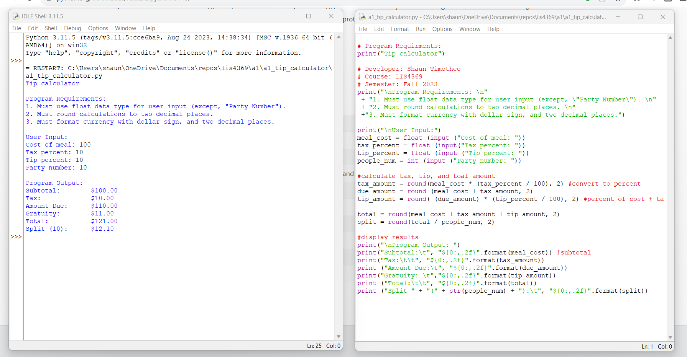
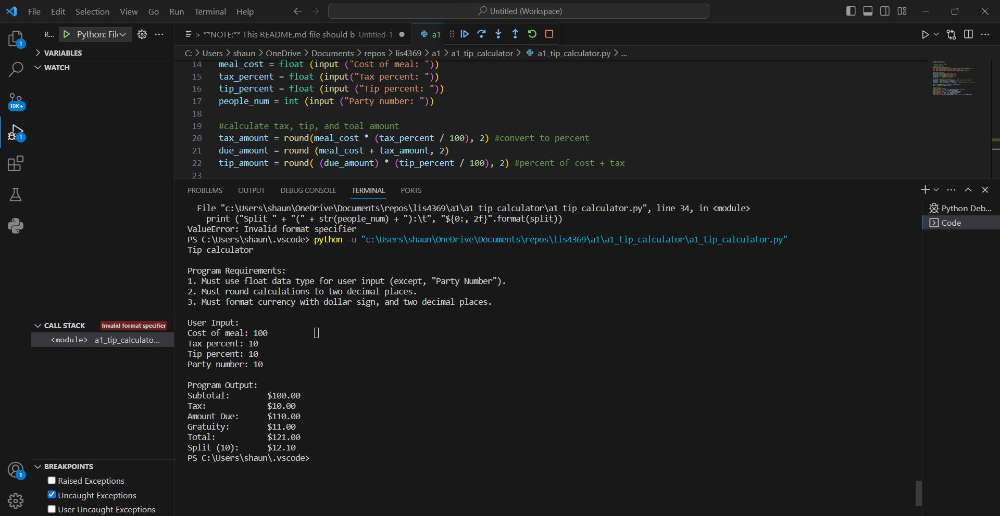

> **NOTE:** This README.md file should be placed at the **root of each of your repos directories.**
>
>Also, this file **must** use Markdown syntax, and provide project documentation as per below--otherwise, points **will** be deducted.
>

# LIS4369

## Shaun Timothee

### Assignment 1 Requirements:

*Four Parts:*

1. Distibuted Version Control with Git BitBucket
2. Develpoment
3. Questions
4. BitBucket repo links:

a) this assignment and 
b) The vompleted tutuorial (bitbucketlocations) 

#### README.md file should include the following items:

* Screenshot of a1_tip_caclulator application running 
* [a1_tip_calculator.ipynb](a1_tip_calculator/a1_tip_calculator.ipynb)
* git commands w/short descriptions

> This is a blockquote.
> 
> This is the second paragraph in the blockquote.
>
> 

#### Git commands w/short descriptions:

1. git init - initializes a git repo
2. git status - displays the state of the working directory
3. git add - adds a change within the working directory
4. git commit - captures a snapshot of the projects staged changes
5. git push - uploads local repo content from a remote 
6. git pull - fetch and download content from a remote repo
7. git clone - used to ctreate a copy of a specific repositorys 

#### Assignment Screenshots:

*Screenshot of a1_tip_calculator running on IDLE*:

*Screenshot of a1_tip_calculator running on VS Code:

*Screenshot of a1_tip_calculator running on Jupyter Notebook*:

#### Tutorial Links:

*Bitbucket Tutorial - Station Locations:*
[A1 Bitbucket Station Locations Tutorial Link](https://bitbucket.org/username/bitbucketstationlocations/ "Bitbucket Station Locations")

*Tutorial: Request to update a teammate's repository:*
[A1 My Team Quotes Tutorial Link](https://bitbucket.org/username/myteamquotes/ "My Team Quotes Tutorial")
