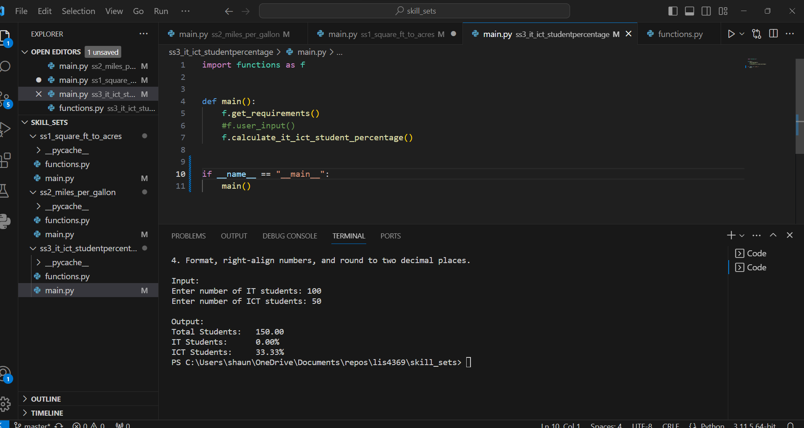

> **NOTE:** This README.md file should be placed at the **root of each of your repos directories.**
>
>Also, this file **must** use Markdown syntax, and provide project documentation as per below--otherwise, points **will** be deducted.
>

# LIS4369

## Shaun Timothee

### Assignment 2 Requirements:

*Payroll Calculator*

1. Must use float data type for user input.
2. Overtime rate: 1.5 times hourly rate (hours over 40).
3. Holiday rate: 2.0 times hourly rate (all holiday hours).
4. Must format currency with dollar sign, and round to two decimal places.
5. Create at least three functions that are called by the program:
        a. main(): calls at least two other functions.
        b. get_requirements(): displays the program requirements.
        c. calculate_payroll(): calculates an individual one-week paycheck.

#### README.md file should include the following items:

* Screenshot of a2_payroll application running
* [a2_payroll.ipynb](a2_payroll/a2_payroll.ipynb)

> This is a blockquote.
> 
> This is the second paragraph in the blockquote.
>
>  

#### Assignment Screenshots:

*Screenshot of a2_payroll running on IDLE*:

*Screenshot of a2_payroll running on VS code*:

*Screenshot of a2_payroll on Jupyter Notebook*:

### Skillset 1 - 3 Screenshots:
| Skillset 1 | Skillset 2 | Skillset 3 |
|--------------------|--------------------|--------------------|
| |  | 
#### Tutorial Links:

*Bitbucket Tutorial - Station Locations:*
[A1 Bitbucket Station Locations Tutorial Link](https://bitbucket.org/username/bitbucketstationlocations/ "Bitbucket Station Locations")

*Tutorial: Request to update a teammate's repository:*
[A1 My Team Quotes Tutorial Link](https://bitbucket.org/username/myteamquotes/ "My Team Quotes Tutorial")

